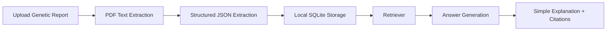
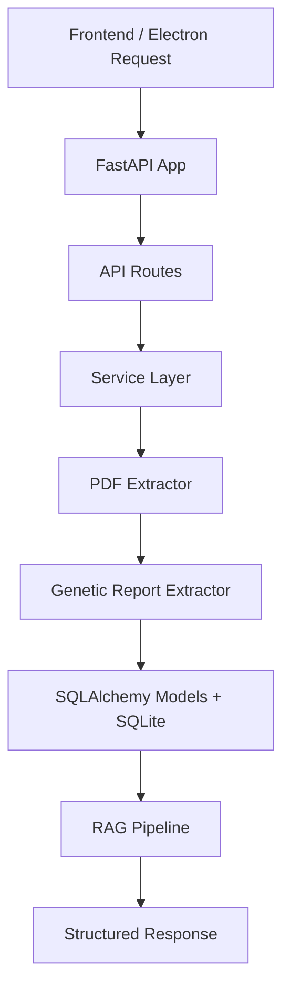

# NeuroMate

Privacy-first RAG-based AI assistant for genetic disease report interpretation.

NeuroMate is a local-first desktop application designed to help patients understand complex genetic test reports, especially for rare neuromuscular conditions such as Charcot-Marie-Tooth disease and muscular dystrophy. It extracts structured findings from reports, stores data locally, and aims to answer patient questions in simple language with grounded evidence and citations.

## Problem

Patients diagnosed with rare genetic diseases often receive limited explanation because clinical time is short. They then turn to the internet and face three major issues:

- information is scattered across many sources
- medical language is difficult to understand
- generic AI tools may require sharing sensitive medical data and can produce outdated or unsupported answers

Genetic data is highly sensitive, so privacy and explainability are core requirements, not optional features.

## Solution

NeuroMate is being built as a personal medical interpreter for genetic reports.

It is designed to:

- process reports locally
- extract key genetic findings into structured JSON
- personalize responses using the uploaded report context
- use retrieval-augmented generation to reduce hallucinations
- provide citations and traceable evidence for answers

## Key Features

- Local-first architecture with no required cloud processing for raw reports
- Genetic report upload and text extraction
- Structured information extraction for gene, variant, zygosity, classification, and disease context
- Modular FastAPI backend designed for RAG workflows
- SQLite + SQLAlchemy local persistence
- Electron desktop shell for privacy-preserving local use
- Vue frontend for report upload and question-answer interaction
- Notebook-validated local LLM extraction using Ollama and `llama3.2:3b`

## Architecture



### Backend Flow



## Tech Stack

- Frontend: Vue
- Desktop wrapper: Electron
- Backend API: FastAPI
- Database: SQLite
- ORM: SQLAlchemy
- PDF parsing: PyPDF
- Local LLM experimentation: Ollama with `llama3.2:3b`
- Embeddings / retrieval groundwork: `sentence-transformers`, NumPy
- Language: Python and JavaScript

## Repository Structure

```text
NeuroMate/
  backend/
    app/
      api/
      core/
      db/
      extractors/
      models/
      rag/
      schemas/
      services/
      utils/
    main.py
    notebook.ipynb
    requirements.txt
  frontend/
  electron/
  Data/
```

### Backend folders

- `app/api`: FastAPI route registration and endpoint handlers
- `app/core`: application configuration
- `app/db`: SQLAlchemy base and database session setup
- `app/extractors`: report parsing and genetic information extraction modules
- `app/models`: ORM models mapped to SQLite tables
- `app/rag`: retrieval, embedding, and grounded answer generation components
- `app/schemas`: request and response schemas
- `app/services`: workflow orchestration and business logic
- `app/utils`: shared helper functions

## Current Status

### Implemented

- Modular backend package structure
- FastAPI app initialization and route organization
- Local SQLite database integration using SQLAlchemy
- Basic report persistence model
- Experimental notebook proving local JSON extraction with Ollama `llama3.2:3b`
- Vue upload/chat scaffold
- Electron wrapper scaffold

### In Progress

- PDF upload pipeline in the backend
- Report text extraction integration
- Genetic report extraction integration from the notebook into production code
- Frontend and backend API route alignment

### Planned

- Hybrid extraction pipeline: regex + local LLM refinement
- OCR fallback for scanned/image-based reports
- Entity-aware chunking and retrieval
- Citation-backed answer generation
- Knowledge base integration with sources like ClinVar, OMIM, and GeneReviews
- Clinician-friendly export summaries

## Example Structured Output

```json
{
  "gene": "PMP22",
  "variant": "17p12 duplication (1.4 Mb region including entire PMP22 gene)",
  "variant_type": "duplication",
  "zygosity": "heterozygous",
  "classification": "pathogenic",
  "disease": "CMT1A",
  "inheritance": "autosomal dominant",
  "symptoms": [],
  "onset": null,
  "confidence": "high",
  "notes": "Extracted from report text using local model refinement."
}
```

## Privacy

Privacy is a core design goal of NeuroMate.

- Raw genetic reports are intended to be processed locally
- Local storage is used for report data
- The system is being designed to avoid sending sensitive report contents to external APIs
- Users should have control over deletion of locally stored data

## Setup

### Prerequisites

- Python 3.11 or newer
- Node.js and npm
- Ollama installed locally
- Local Ollama model available, for example:

```bash
ollama pull llama3.2:3b
```

### Backend

```bash
cd backend
python -m venv venv
venv\Scripts\activate
pip install -r requirements.txt
uvicorn main:app --reload
```

The backend will be available at `http://localhost:8000`.

### Frontend

```bash
cd frontend
npm install
npm run dev
```

The frontend dev server will be available at `http://localhost:5173`.

### Electron

```bash
cd electron
npm install
npm start
```

Note: the Electron setup currently assumes a running frontend dev server and backend process flow is still being refined.

## Usage

1. Start the backend.
2. Start the frontend or Electron app.
3. Upload a genetic test report.
4. Extract and store report findings locally.
5. Ask questions about the report in plain language.
6. Review grounded answers and citations.

## Data Sources and Development Strategy

Current development is expected to use:

- synthetic reports
- sample laboratory reports
- public resources such as ClinVar and OMIM
- research papers and disease documentation

Planned evaluation strategy:

- compare extracted output against expected structured fields
- test across multiple report formats
- validate retrieval quality and citation relevance

## Limitations

- This project is still in MVP development
- Backend extraction and RAG flow are not fully wired end to end yet
- Report formats can vary widely, so extraction robustness is still under active development
- Current outputs should not be treated as a substitute for clinical review

## Medical Disclaimer

NeuroMate is a research and development project. It is not a medical device and does not replace advice from qualified healthcare professionals, genetic counselors, or neurologists. Any information generated by the system should be reviewed with an appropriate clinician.

## Roadmap

- Integrate notebook-tested Ollama extraction into backend services
- Add report upload and PDF parsing pipeline
- Add OCR support for scanned reports
- Store structured extraction results in the database
- Implement retrieval over patient report + curated knowledge base
- Generate simple, detailed, citation-backed answers
- Add doctor-facing report summary export

## Contributing

Contributions, issues, and architecture suggestions are welcome. If you want to contribute:

- open an issue describing the problem or idea
- discuss major architectural changes before implementation
- keep privacy, explainability, and local-first design as core priorities

## License

Add a license here before public distribution. If you are unsure, a common starting point for open-source academic or prototype projects is MIT, but choose a license that matches your intended use.
