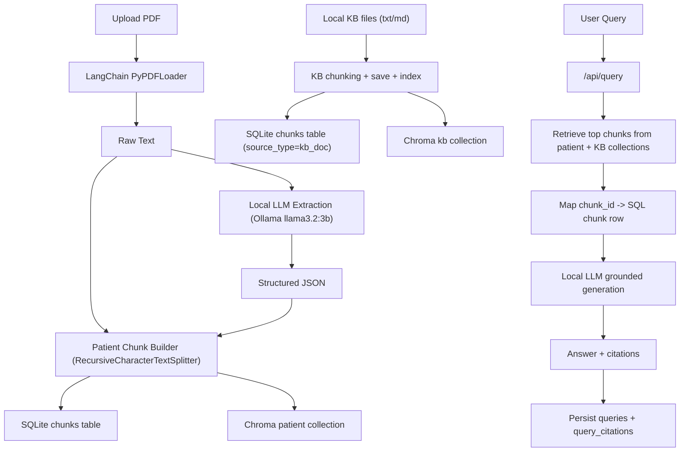

# NeuroMate

Privacy-first, local-first RAG assistant for interpreting genetic test reports.

NeuroMate helps users understand complex genetic reports (especially rare neuromuscular disease contexts) by extracting structured findings, indexing report context, retrieving relevant evidence, and generating grounded answers with citations.

## What It Does

- Uploads a genetic report PDF
- Extracts raw text and structured JSON using a local LLM (`llama3.2:3b`)
- Stores report data locally in SQLite
- Builds patient chunks and indexes them in local Chroma vector DB
- Supports optional local knowledge-base ingestion and indexing
- Answers user questions via dual retrieval (patient chunks + KB chunks)
- Returns citation snippets and supports fetching full citation context

## Architecture (Current)



## Tech Stack

- Frontend: Vue
- Desktop wrapper: Electron
- Backend API: FastAPI
- ORM/DB: SQLAlchemy + SQLite
- RAG indexing: LangChain + Chroma
- Embeddings: HuggingFace embeddings via LangChain (`all-MiniLM-L6-v2`)
- PDF extraction: LangChain community `PyPDFLoader`
- Local generation/extraction LLM: Ollama (`llama3.2:3b`)

## Database Schema (Implemented)

- `users`
  - `user_id`, `name`, `age`, `email (unique)`, `password_hash`, `created_at`
- `reports`
  - `report_id`, `user_id`, `filename`, `raw_text`, `extraction_status`, `extracted_data_json`, `created_at`
- `chunks`
  - `chunk_id`, `report_id (nullable for KB)`, `source_type`, `text`, `source_url`, `metadata_json`, `created_at`
- `queries`
  - `query_id`, `user_id`, `report_id`, `query_text`, `answer_text`, `created_at`
- `query_citations`
  - `query_citation_id`, `query_id`, `chunk_id`, `rank`, `score`, `created_at`

## API Endpoints (Current)

- `POST /api/reports/upload`
  - Upload report PDF
  - Extracts raw text + structured JSON
  - Creates and stores patient chunks
  - Indexes patient chunks in vector DB

- `POST /api/query`
  - Input: `query_text`, optional `report_id`, optional `top_k`
  - Retrieves relevant chunks from patient + KB collections
  - Generates answer with citations
  - Persists query and citation mapping

- `POST /api/kb/index`
  - Indexes local KB files from backend `kb` directory (`.txt`, `.md`)
  - Saves KB chunks in SQL and vector DB

- `GET /api/chunks/{chunk_id}`
  - Returns full chunk content + metadata for citation drill-down

- `GET /api/health`
  - Health check

## Frontend Behavior (Current)

- First screen: upload-only flow
- Upload progress/loading state during extraction + indexing
- After completion:
  - patient summary
  - extracted JSON viewer
  - chat interface
- Chat displays:
  - generated answer
  - citation cards (rank, score, source type, excerpt)
  - full citation context via chunk detail endpoint

## Repository Structure

```text
NeuroMate/
  backend/
    app/
      api/
      core/
      db/
      extractors/
      models/
      rag/
      schemas/
      services/
      utils/
    data/
    chroma_db/
  frontend/
  electron/
```

## Setup

### Prerequisites

- Python 3.11+
- Node.js + npm
- Ollama installed locally
- Ollama model:

```bash
ollama pull llama3.2:3b
```

### Backend

```bash
cd backend
python -m venv venv
venv\Scripts\activate
pip install -r requirements.txt
uvicorn main:app --reload
```

Backend runs at `http://localhost:8000`.

### Frontend

```bash
cd frontend
npm install
npm run dev
```

Frontend runs at `http://localhost:5173`.

### Optional: Knowledge Base Folder

Create:

```text
backend/kb/
```

Put `.txt`/`.md` files there, then call:

```bash
POST /api/kb/index
```

## Current Limitations

- KB ingestion currently supports `.txt` and `.md` (not KB PDFs yet)
- Embedding model should be available locally for strict offline behavior
- Retrieval/reranking is basic similarity-based (no advanced reranker yet)
- Medical output is assistive only, not clinical advice

## Medical Disclaimer

NeuroMate is a research/development assistant and not a medical device. It does not replace advice from qualified healthcare professionals, genetic counselors, or neurologists.

## License
This project is licensed under the MIT Licens
